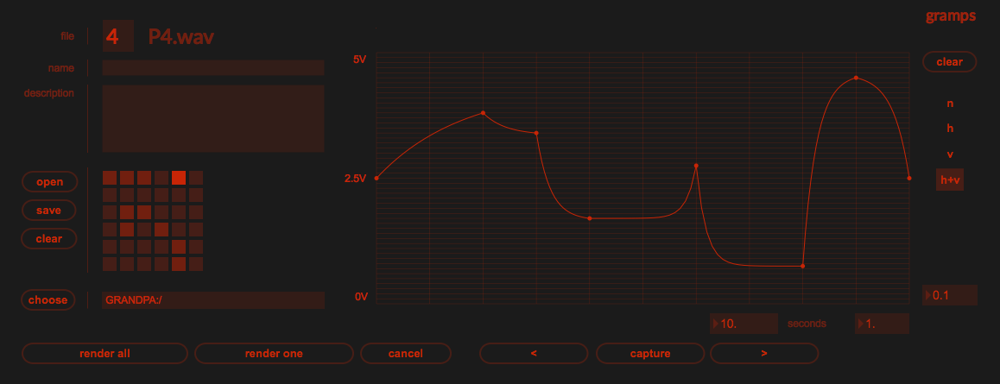

# gramps

cv sample file generator for bastl instruments grandpa

## notes

choose the curve/file to edit by scrubbing the mouse on the file
number, typing a file number, or choosing a preset from the preset
matrix

edit the curve; click to add, shift click to remove, hold the option
key to adjust the shape. when satisfied press capture or shift click a
location in the preset matrix. the total time for the curve can be set
in seconds

collections of all 36 curves can be saved to a json file and opened
later

wave files can be rendered one at a time or all together. rendering
writes files to the chosen destination directory.

## caveats

rendering is slow (currently) and overdrive must be enabled to get
even choppy ui updating. if render all is taking too long press
cancel, rendering should stop after the current curve is complete.

